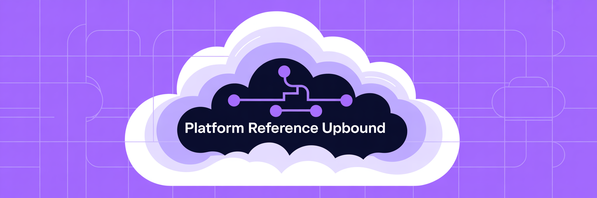

# Platform Reference Upbound 

This Upbound project enables declarative bootstrapping of Upbound Spaces environments with Cloud Provider integration through a GitOps approach.

# Table of Contents
- [💡 Overview](#-overview)
- [🛠 Prerequisites](#-prerequisites)
- [💻 Getting Started](#-getting-started)
- [🏗️ Architecture](#-architecture)
- [🔧 Optional Component Configuration](#-optional-component-configuration)
- [💜 XUpboundRepoSet](#-xupboundreposet)
- [🐛 Development](#-development)


## 💡 Overview

### This repository:
- **Declarative Environment Management**: Defines your entire environment as code via `XEnvironment` and `XUpboundRepoSet` resources
- **AWS Integration**: Automatically sets up IAM roles, policies, and OIDC authentication
- **Secret Management**: Securely transfers credentials between AWS and Upbound
- **Bootstrap Secret Synchronization**: Copies secrets from bootstrap control plane to target environments
- **Team & Robot Automation**: Creates teams, robots, and tokens for automated workflows
- **Repository Management**: Creates and configures Upbound repositories with team permissions and robot access
- **GitOps Ready**: Designed for continuous delivery workflows
- **Optional Components**: Flexibility to enable/disable specific features as needed:
  - AWS Provider Role with OIDC
  - AWS Secrets Manager integration
  - Upbound Team with Robot setup
  - Bootstrap secret synchronization


### What does `XEnvironment` Resource do?
- Upbound Control Planes in Spaces
- AWS IAM roles and permissions
- Cross-service authentication with OIDC
- Secret management between AWS and Upbound
- Secret synchronization from bootstrap control plane to environment
- Provider configurations for Kubernetes resources
- Teams, robots, and robot tokens for automation

### What does `XUpboundRepoSet` Resource do?
- Upbound repositories creation and configuration
- Team-based permission management for repositories
- Consistent repository configuration across your organization


## 🛠 Prerequisites
* [An Upbound Account](https://www.upbound.io/register/a) with appropriate permissions
*  Access to AWS account
*  `kubectl` CLI installed and configured
* [Upbound CLI (`up`)](https://docs.upbound.io/cli/)


## 💻 Getting Started

1. Create a Group and Control Plane on Upbound

   *This step establishes your Upbound organizational structure. The group organizes your control planes, and the control plane is where Crossplane will run to manage your infrastructure.*

```bash
UPBOUND_ORG="your_upbound_org"
# Other spaces are available, check with `up ctx`
UPBOUND_SPACE="upbound-gcp-us-west-1"
UPBOUND_GROUP="my-group"
UPBOUND_CTP="bootstrap"

# Login and switch context
up login -a $UPBOUND_ORG --profile $UPBOUND_ORG
up ctx "${UPBOUND_ORG}/${UPBOUND_SPACE}"

# Create group
up group create "${UPBOUND_GROUP}"

# Switch context to group
up ctx "${UPBOUND_ORG}/${UPBOUND_SPACE}/${UPBOUND_GROUP}"

# Create control plane
up ctp create "${UPBOUND_CTP}" --crossplane-channel="Rapid"

# Check status of control plane (should show Healthy: True)
up ctp list

# Switch context to control plane (might take a minute to become ready)
up ctx "${UPBOUND_ORG}/${UPBOUND_SPACE}/${UPBOUND_GROUP}/${UPBOUND_CTP}"
```

2. Create personal access token for Upbound

   *The token enables API authentication with Upbound services. This will be used by Crossplane providers to interact with your control planes.*

- Navigate to `https://console.upbound.io/`
- Choose your organization and click on "Console"
- Click on your user profile in the upper right corner
- Click on "My Account"
- Select "API Tokens" from the left navigation
- Click "Create New Token"
- Enter a name for your token and click "Create Token"
- Copy the Token value (Access ID is not needed for this use case)

3. Create Kubernetes secrets for the token

   *This step stores your Upbound token securely in Kubernetes as a secret, allowing your resources to authenticate with Upbound.*

```bash
TOKEN="Paste token here!"

cat <<EOF | kubectl apply -f -
  apiVersion: v1
  kind: Secret
  metadata:
    name: bootstrap-token
    namespace: default
  type: Opaque
  stringData:
    token: ${TOKEN}
EOF
```

4. Create `kubeconfig` for provider-kubernetes

   *This creates a special `kubeconfig` that allows Crossplane's Kubernetes provider to interact with your control plane. It references the token created in the previous step.*

```bash
up ctx . -f - > kubeconfig.yaml
kubectl -n default create secret generic bootstrap-kubeconfig --from-file=kubeconfig=kubeconfig.yaml
```

5. Install the configuration:

   *This installs the bootstrap configuration package into your control plane. The configuration contains the `XEnvironment` CRD and composition function that automate environment setup.*

```bash
VERSION=""

cat <<EOF | kubectl apply -f -
  apiVersion: pkg.crossplane.io/v1
  kind: Configuration
  metadata:
    name: platform-ref-upbound
  spec:
    package: xpkg.upbound.io/upbound/platform-ref-upbound:"${VERSION}"
EOF
```

6. Create provider config for provider-kubernetes

   *This configures the Kubernetes provider to use your `kubeconfig` and token from the earlier steps, enabling it to create resources in your control plane.*

```bash
cat <<EOF | kubectl apply -f -
  apiVersion: kubernetes.crossplane.io/v1alpha1
  kind: ProviderConfig
  metadata:
    name: ${UPBOUND_CTP}-ctp
  spec:
    credentials:
      source: Secret
      secretRef:
        name: bootstrap-kubeconfig
        namespace: default
        key: kubeconfig
    identity:
      type: UpboundTokens
      source: Secret
      secretRef:
        name: bootstrap-token
        namespace: default
        key: token
EOF
```

7. Configure credentials for provider-aws (option 1, static credentials)

   *This creates a secret containing your AWS credentials, allowing the AWS provider to authenticate with AWS services.*

```bash
SECRET_PATH=path/to/aws/credentials
kubectl create secret generic "aws-creds" -n default --from-file=credentials="${SECRET_PATH}"
```

8. Create an `XEnvironment` resource:

   *Finally, this creates the XEnvironment resource that ties everything together. This triggers the composition function to create all the necessary resources in both AWS and Upbound to establish your environment.*

```bash
AWS_ACCOUNT_ID="your_accountid"
AWS_REGION="us-east-1"

cat <<EOF | kubectl apply -f -
  apiVersion: sa.upbound.io/v1
  kind: XEnvironment
  metadata:
    name: example
  spec:
    parameters:
      aws:
        accountId: "${AWS_ACCOUNT_ID}"
        credsSecretRef:
          name: aws-creds
          namespace: default
        region: "${AWS_REGION}"
        # Empty objects will create new resources
        # To use existing resources, specify ARNs as shown in the commented values
        providerRole: {}
          # oidcProviderArn: "arn:aws:iam::your_accountid:oidc-provider/proidc.upbound.io"
        sharedSecret: {}
          # secretsManagerSecretArn: "arn:aws:secretsmanager:region:your_accountid:secret:example-config-abcde"
      upbound:
        initKubeconfigSecretRef:
          name: bootstrap-kubeconfig
        tokenSecretRef:
          name: bootstrap-token
        # Optional: Creates a team with associated robot and token when specified
        teamWithRobot: {}
        # Optional: Synchronize secrets from bootstrap control plane to this environment
        secretSync:
          - sourceRef:
              name: source-secret-name
              namespace: default
            destRef:
              name: destination-secret-name
              namespace: default
EOF
```

## 🏗️ Architecture


## 🔧 Optional Component Configuration

### AWS Components

The following AWS components can be optionally configured or omitted:

#### Provider Role with OIDC

When the `providerRole` parameter is specified:
- If specified as an empty object (`providerRole: {}`), a new OIDC provider and IAM role will be created
- To use an existing OIDC provider, specify its ARN: `providerRole: { oidcProviderArn: "arn:aws:..." }`

#### Secrets Manager Integration

When the `sharedSecret` parameter is specified:
- If specified as an empty object (`sharedSecret: {}`), a new AWS Secrets Manager secret will be created
- To use an existing secret, specify its ARN: `sharedSecret: { secretsManagerSecretArn: "arn:aws:..." }`

### Upbound Components

#### Secret Synchronization

When the `secretSync` parameter is specified, the bootstrap configuration copies secrets from the bootstrap control plane to the target environment control plane. This feature is useful for sharing robot tokens with CI environments and making secrets created in the bootstrap context available in the new environment.

Example configuration:
```yaml
secretSync:
  - sourceRef:
      name: source-secret-name
      namespace: default
    destRef:
      name: destination-secret-name
      namespace: default
```

#### Teams, Robots, and Tokens

When the `teamWithRobot` parameter is specified (even as an empty object), the bootstrap configuration automatically creates:

1. **Team** - A dedicated team for the environment with the same name as the environment group
2. **Robot** - A service account robot associated with your organization
3. **Robot Token** - A token for the robot to authenticate with Upbound APIs
4. **Robot Team Membership** - Associates the robot with the team for proper permissions
5. **Admin Role Binding** - Grants the team admin rights on the environment group

These resources enable automation through GitOps and CI/CD pipelines, allowing programmatic interaction with control planes. The team structure ensures proper access control and permission management for your environment.

If you don't need team and robot resources, simply omit the `teamWithRobot` parameter from your XEnvironment specification.

## 💜 XUpboundRepoSet

The `XUpboundRepoSet` custom resource allows you to manage Upbound repositories and their permissions declaratively.

### Usage Example

```yaml
apiVersion: sa.upbound.io/v1
kind: XUpboundRepoSet
metadata:
  name: example
spec:
  parameters:
    organization: your-organization
    permissions:
      teams:
        your-team-name:
          permission: write
    repositories:
      repo-name-1: {}
      repo-name-2: {}
    tokenSecretRef:
      name: your-token-secret
      namespace: default
      key: token
```

### Parameters

| Parameter | Description |
|-----------|-------------|
| `organization` | The Upbound organization name |
| `permissions.teams` | Map of team names to permission objects (with permission type: "read", "write", "admin") |
| `repositories` | Map of repository names to empty objects |
| `tokenSecretRef` | Reference to a Kubernetes secret containing the Upbound token |
| `tokenSecretRef.name` | Name of the secret |
| `tokenSecretRef.namespace` | Namespace for the secret (defaults to "default") |
| `tokenSecretRef.key` | Key in the secret (defaults to "token") |

## 🐛 Development

### Testing

The repository includes multiple test configurations:

- Basic functionality tests: `tests/test-xenvironment/`
- Deletion policy tests: `tests/test-xenvironment-deletion-policy-delete/`
- No cloud provider resources: `tests/test-xenvironment-no-cloudprovider-resource/`

To run tests:

```bash
up test run tests/test-*
```
