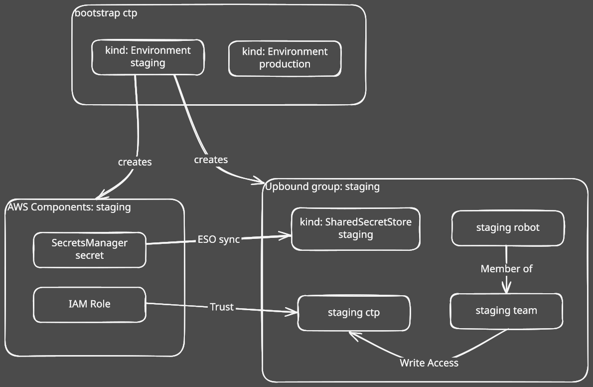

# Platform Reference Upbound


Declaratively bootstrap Upbound Spaces environments — control planes, AWS IAM, secret
distribution, teams and repositories — as Crossplane APIs, ready for GitOps.

- [How it works](#how-it-works)
- [Prerequisites](#prerequisites)
- [Getting started](#getting-started)
- [API reference](#api-reference)
  - [Environment](#environment)
  - [SharedAWSSecret](#sharedawssecret)
  - [UpboundRepoSet](#upboundreposet)
- [Development](#development)

> **Crossplane v2 — breaking change in v1.0.0.** The APIs are now
> `apiextensions.crossplane.io/v2` with `scope: Namespaced`, and the `X` prefix is gone:
> `XEnvironment`→`Environment`, `XSharedAWSSecret`→`SharedAWSSecret`,
> `XUpboundRepoSet`→`UpboundRepoSet`. XRs need a `metadata.namespace`, you list them with
> `kubectl get environments -n <ns>`, and Crossplane **v2.0+** is required. There is no
> in-place upgrade path from v0.7.x — deploy into a fresh control plane.

---

## How it works



The single most important thing to understand is that **two kinds of control plane are
involved**, and they play very different roles.

```
┌─ bootstrap control plane ──────────────┐        ┌─ environment control plane ─┐
│                                        │        │                             │
│  Environment / SharedAWSSecret XRs     │ ─────▶ │  created by the composition │
│  all composed managed resources        │        │  starts EMPTY               │
│  providers + ProviderConfigs           │        │                             │
│  (Argo CD lives here)                  │ ◀───── │  registered as an Argo CD   │
│                                        │        │  cluster target             │
└────────────────────────────────────────┘        └─────────────────────────────┘
          │                          │
          ▼                          ▼
   Upbound Spaces API            AWS (IAM, Secrets Manager)
   groups, control planes,
   SharedSecretStore
```

You install this configuration onto a **bootstrap** control plane. Every XR and every
composed resource lives there. Applying an `Environment` makes the composition reach
*outward* — creating a group and a new control plane through the Spaces API, and IAM roles
and secrets in AWS.

**The environment control plane it creates is intentionally empty.** Nothing here deploys
workloads into it. Instead the composition writes an Argo CD cluster-registration secret
back onto the bootstrap control plane, and Argo CD takes it from there. So
`up alpha query managed` against a freshly created environment returning nothing is the
expected result, not a failure.

`Environment` derives everything it needs about the Space — host, organization, bootstrap
group and bootstrap control plane name — by observing the bootstrap `kubeconfig` secret and
parsing its server URL. That is why step 4 below matters, and why the XR briefly reports
`status.upbound` as empty on its first reconcile.

---

## Prerequisites

| | |
|---|---|
| Upbound | An [account](https://www.upbound.io/register/a) with permission to create groups and control planes |
| AWS | An account, and credentials or a web-identity role — see [AWS credentials](#aws-credentials) |
| Crossplane | **v2.0+** on the bootstrap control plane |
| CLI | [`up`](https://docs.upbound.io/cli/) and `kubectl` |

---

## Getting started

### 1. Create a group and a bootstrap control plane

```bash
UPBOUND_ORG="your_upbound_org"
UPBOUND_SPACE="upbound-gcp-us-west-1"   # other spaces exist; see `up ctx`
UPBOUND_GROUP="my-group"
UPBOUND_CTP="bootstrap"

up login -a $UPBOUND_ORG --profile $UPBOUND_ORG
up ctx "${UPBOUND_ORG}/${UPBOUND_SPACE}"

up group create "${UPBOUND_GROUP}"
up ctx "${UPBOUND_ORG}/${UPBOUND_SPACE}/${UPBOUND_GROUP}"

up ctp create "${UPBOUND_CTP}" --crossplane-channel="Rapid"
up ctp list    # wait for Healthy: True

up ctx "${UPBOUND_ORG}/${UPBOUND_SPACE}/${UPBOUND_GROUP}/${UPBOUND_CTP}"
```

### 2. Create an Upbound token

```bash
up token create platform-ref-upbound -f token.json
```

Or via the console: **My Account → API Tokens → Create New Token**. Only the token value is
needed; the Access ID is not used.

### 3. Store the token and a kubeconfig on the control plane

```bash
kubectl create secret generic bootstrap-token -n default \
  --from-literal=token="$(jq -r .token token.json)"

up ctx . -f - > kubeconfig.yaml
kubectl create secret generic bootstrap-kubeconfig -n default \
  --from-file=kubeconfig=kubeconfig.yaml
```

### 4. Install the configuration

```bash
VERSION="v1.0.0"

cat <<EOF | kubectl apply -f -
apiVersion: pkg.crossplane.io/v1
kind: Configuration
metadata:
  name: platform-ref-upbound
spec:
  package: xpkg.upbound.io/upbound/platform-ref-upbound:${VERSION}
EOF
```

### 5. Configure the provider runtimes — **required**

Two provider defaults suit standalone Crossplane but not Upbound Spaces. Without both, the
composition will not reconcile.

> Both must be set as **environment variables**, not container args. The Spaces admission
> webhook rejects arbitrary `args` on a package runtime but permits env vars.

**a. Enable ManagementPolicies on `provider-upbound`.** Namespaced Crossplane v2 resources
have no `deletionPolicy` field, so `parameters.deletionPolicy: Orphan` is implemented with
`managementPolicies`. `provider-upbound` gates that behind an alpha feature that defaults to
off, so without this the composed `Repository` and `Team` fail with ``spec.managementPolicies
is set to a non-default value but the feature is not enabled``.

> **Temporary.** [provider-upbound#41](https://github.com/upbound/provider-upbound/pull/41)
> flips that default to true and is merged, but is not in a release yet — the latest is
> v1.1.1, which this configuration pins. Once a release containing it ships, bump
> `provider-upbound` in `upbound.yaml` and delete this step along with the
> `enable-management-policies` DeploymentRuntimeConfig. Step **b** has no such fix pending:
> server-side apply is the correct default for `provider-kubernetes` generally, and Spaces is
> the exception, so that one stays.

**b. Disable server-side apply on `provider-kubernetes`.** Spaces *control planes* accept
server-side apply — they are ordinary Kubernetes API servers — but the **Spaces API gateway**
(`https://<spaceHost>`, which serves groups and `spaces.upbound.io` resources) does not.
Objects created through the gateway — the environment group, the control plane, the
`SharedSecretStore` and `SharedExternalSecret` — fail with ``Unsupported patch format. Only
merge and json patch are supported.`` Turning the flag off selects the provider's merge-patch
syncer, which the gateway accepts.

```bash
cat <<'EOF' | kubectl apply -f -
apiVersion: pkg.crossplane.io/v1beta1
kind: DeploymentRuntimeConfig
metadata:
  name: enable-management-policies
spec:
  deploymentTemplate:
    spec:
      selector: {}
      template:
        spec:
          containers:
          - name: package-runtime
            env:
            - name: ENABLE_MANAGEMENT_POLICIES
              value: "true"
---
apiVersion: pkg.crossplane.io/v1beta1
kind: DeploymentRuntimeConfig
metadata:
  name: disable-server-side-apply
spec:
  deploymentTemplate:
    spec:
      selector: {}
      template:
        spec:
          containers:
          - name: package-runtime
            env:
            - name: ENABLE_SERVER_SIDE_APPLY
              value: "false"
EOF

kubectl patch provider.pkg.crossplane.io upbound-provider-upbound --type merge \
  -p '{"spec":{"runtimeConfigRef":{"apiVersion":"pkg.crossplane.io/v1beta1","kind":"DeploymentRuntimeConfig","name":"enable-management-policies"}}}'

kubectl patch provider.pkg.crossplane.io upbound-provider-kubernetes --type merge \
  -p '{"spec":{"runtimeConfigRef":{"apiVersion":"pkg.crossplane.io/v1beta1","kind":"DeploymentRuntimeConfig","name":"disable-server-side-apply"}}}'
```

### 6. Create the bootstrap ProviderConfig

This is the **namespaced** `kubernetes.m.crossplane.io/v1alpha1` kind, and it must live in the
same namespace as the `Environment` XR.

```bash
cat <<EOF | kubectl apply -f -
apiVersion: kubernetes.m.crossplane.io/v1alpha1
kind: ProviderConfig
metadata:
  name: ${UPBOUND_CTP}-ctp
  namespace: default
spec:
  credentials:
    source: Secret
    secretRef: {name: bootstrap-kubeconfig, namespace: default, key: kubeconfig}
  identity:
    type: UpboundTokens
    source: Secret
    secretRef: {name: bootstrap-token, namespace: default, key: token}
EOF
```

### 7. Provide AWS credentials

See [AWS credentials](#aws-credentials) for the web-identity alternative, which needs no
secret at all.

```bash
kubectl create secret generic aws-creds -n default \
  --from-file=credentials=path/to/aws/credentials
```

### 8. Create an `Environment`

```yaml
apiVersion: sa.upbound.io/v1
kind: Environment
metadata:
  name: example
  namespace: default
spec:
  parameters:
    deletionPolicy: Orphan          # Orphan (default) | Delete
    aws:
      accountId: "123456789012"
      region: us-east-1
      credsSecretRef:
        name: aws-creds
        namespace: default
      providerRole: {}              # create OIDC provider + admin role
      sharedSecret: {}              # create Secrets Manager integration
    upbound:
      initKubeconfigSecretRef:
        name: bootstrap-kubeconfig
      tokenSecretRef:
        name: bootstrap-token
```

Watch it converge:

```bash
kubectl get environment example -n default -w
kubectl describe environment example -n default
```

> **Argo CD.** `createArgoSecret` defaults to `true`, and the registration secret is written
> into the `argocd` namespace **on the bootstrap control plane**. If Argo CD is not installed
> there the XR stalls at `Unready resources: ctp-argocd`. Install
> [`addon-argocd-core`](https://marketplace.upbound.io/addons/upbound/addon-argocd-core), or
> set `createArgoSecret: false`.

---

## API reference

### Environment

Creates an Upbound Spaces environment and its AWS integration.

| Parameter | Description |
|---|---|
| `deletionPolicy` | `Orphan` (default) or `Delete`. Controls whether managed resources survive deleting the XR |
| `aws.accountId` | AWS account ID — **required** when `aws` is set |
| `aws.region` | AWS region — **required** when `aws` is set |
| `aws.roleArn` | Role ARN for web identity. Mutually exclusive with `credsSecretRef` |
| `aws.credsSecretRef` | Secret holding static AWS credentials under key `credentials` |
| `aws.providerRole` | Create the OIDC provider and admin IAM role. `{}` creates both; `{oidcProviderArn: ...}` adopts an existing provider |
| `aws.sharedSecret` | Create the Secrets Manager integration — see [SharedAWSSecret](#sharedawssecret) |
| `upbound.initKubeconfigSecretRef` | **Required.** Bootstrap kubeconfig secret; parsed to derive Space host, org, group and control plane |
| `upbound.tokenSecretRef` | **Required.** Upbound token secret |
| `upbound.initProviderConfigName` | ProviderConfig used to observe the bootstrap secret. Default `bootstrap-ctp` |
| `upbound.createGroup` / `createCtp` | Create the environment group and control plane. Default `true` |
| `upbound.createArgoSecret` | Write the Argo CD cluster registration. Default `true` |
| `upbound.teamWithRobot` | Create a Team, Robot, RobotToken, membership and an admin role binding on the group |
| `upbound.secretSync` | Copy secrets from the bootstrap control plane into the environment |

`status.upbound` reports the values derived from the bootstrap kubeconfig: `spaceHost`,
`org`, `bootstrapGroup`, `bootstrapCtp`.

#### AWS credentials

Two options. **Web identity is preferred** — no credential is stored anywhere:

```yaml
aws:
  roleArn: arn:aws:iam::123456789012:role/my-provider-aws-role
```

The role's trust policy must allow the bootstrap control plane's OIDC subject:

```
Federated: arn:aws:iam::<account>:oidc-provider/proidc.upbound.io
sub:       mcp:<org>/<bootstrap-ctp>:provider:provider-aws
aud:       sts.amazonaws.com
```

Otherwise use `credsSecretRef` with a standard AWS credentials file.

> The OIDC provider is an **account-wide singleton** — AWS permits only one per URL. If
> `proidc.upbound.io` already exists in the account, pass its ARN as
> `providerRole.oidcProviderArn` so it is adopted rather than duplicated.
>
> An adopted provider is **always orphaned**, whatever `deletionPolicy` says, because the
> composition did not create it and deleting it would break every other Upbound integration
> in that AWS account. A provider the composition *does* create follows `deletionPolicy`
> normally.

#### secretSync

```yaml
upbound:
  secretSync:
  - sourceRef: {name: source-secret, namespace: default}
    destRef:   {name: dest-secret,   namespace: default}
```

Useful for sharing robot tokens with CI, or making bootstrap-created secrets available inside
a new environment.

---

### SharedAWSSecret

Bridges AWS Secrets Manager into Upbound Spaces via the External Secrets Operator. Created
automatically by `Environment` when `aws.sharedSecret` is set, and usable standalone.

It composes an IAM user, policy and access key with read access to one secret, the Secrets
Manager secret itself, and a `SharedSecretStore` plus `SharedExternalSecret` that project it
into the target control plane.

> The IAM user exists because `SharedSecretStore` does not yet support IAM roles. It issues a
> **long-lived access key** — factor that into your credential hygiene.

```yaml
apiVersion: sa.upbound.io/v1
kind: SharedAWSSecret
metadata:
  name: example-shared-secret
  namespace: default
spec:
  parameters:
    deletionPolicy: Orphan
    aws:
      accountId: "123456789012"
      region: us-east-1
      namePrefix: my-env
      providerConfigRef: {name: my-env}
      secretsManagerSecret:
        name: my-secret          # optional; defaults to <namePrefix>-config
        create: true             # false to use an existing secret
    upbound:
      group: my-env
      controlPlane: my-ctp
      providerConfigRef: {name: my-env-group}
    externalSecret:
      namespace: default         # target namespace for the projected secret
```

| Parameter | Description |
|---|---|
| `aws.namePrefix` | Prefix for generated AWS resource names |
| `aws.secretsManagerSecret.name` | Override the default `<namePrefix>-config` secret name |
| `aws.secretsManagerSecret.create` | `false` to reference an existing secret instead of creating one |
| `aws.secretsManagerSecret.arn` | Adopt an existing secret by ARN |
| `externalSecret.namespace` | Namespace the projected secret lands in. Default `default` |
| `externalSecret.name` | Name of the `SharedExternalSecret`. Defaults to the control plane name |
| `externalSecret.spec.data` | Per-key extraction, taking precedence over bulk extraction |
| `externalSecret.spec.target.template.data` | Templated transformations |
| `externalSecret.spec.target.template.metadata.labels` | Labels on the projected secret |

IAM names are truncated to AWS's 64-character limit, preserving the prefix and appending a
hash for uniqueness:

```
very-long-secret-name-that-exceeds-sixty-four-characters-secrets-read
                              -> very-long-secret-name-that-exceeds-12345678-secrets-read
```

---

### UpboundRepoSet

Manages Upbound repositories and their team permissions declaratively.

```yaml
apiVersion: sa.upbound.io/v1
kind: UpboundRepoSet
metadata:
  name: example
  namespace: default
spec:
  parameters:
    organization: your-organization
    settings:
      public: false
      publish: false
    repositories:
      repo-one: {}
      repo-two: {public: true}      # per-repo override
    permissions:
      teams:
        your-team:
          permission: write         # read | write | admin
    tokenSecretRef:
      name: bootstrap-token
      namespace: default
      key: token
```

| Parameter | Description |
|---|---|
| `organization` | Upbound organization name |
| `settings.public` / `settings.publish` | Defaults applied to every repository |
| `repositories` | Map of repository name to optional `{public, publish}` overrides |
| `permissions.teams` | Map of team name to `{permission}` |
| `tokenSecretRef` | Secret holding the Upbound token (`name`, `namespace`, `key`) |

Repositories are created with an orphaning `managementPolicies`, so deleting the XR does not
delete the repository or its published packages.

---

## Development

```bash
up project build
up test run "tests/*"              # composition tests
up test run "tests/*" --e2e        # end-to-end, against a real control plane
```

| Suite | Covers |
|---|---|
| `tests/test-environment` | full environment, all features enabled |
| `tests/test-environment-deletion-policy-delete` | `deletionPolicy: Delete` → `managementPolicies: ["*"]` |
| `tests/test-environment-no-cloudprovider-resource` | environment with no AWS resources |
| `tests/test-environment-uninitialized` | first reconcile, before `status.upbound` exists |
| `tests/test-sharedawssecret*` | secret integration, name overrides, truncation, omitted blocks |
| `tests/test-upboundreposet*` | repository and permission generation |

A green composition suite proves the rendered output matches expectations. It does not prove
the API server accepts those resources, nor that AWS or the Spaces API do — several bugs in
this repository's history were visible only on a live control plane.
